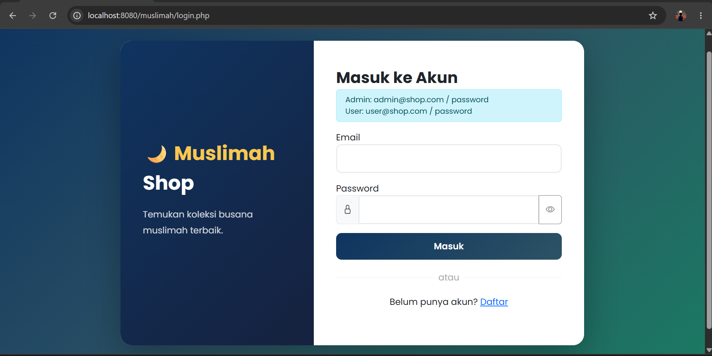
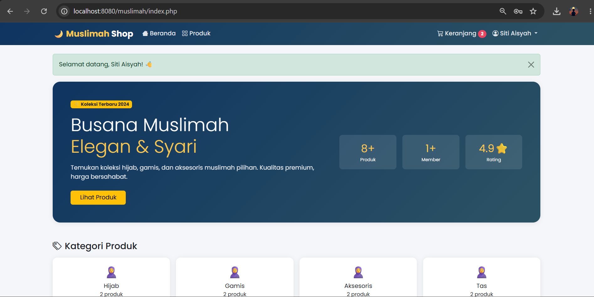
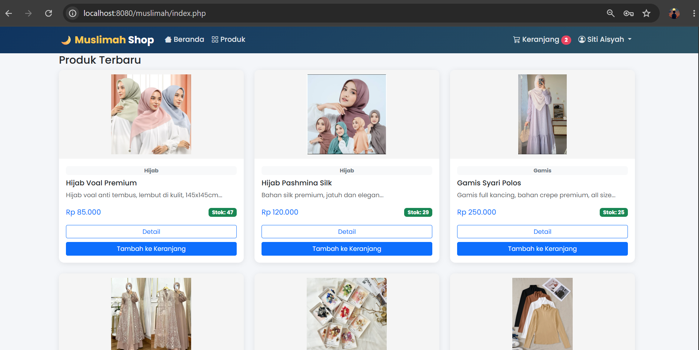
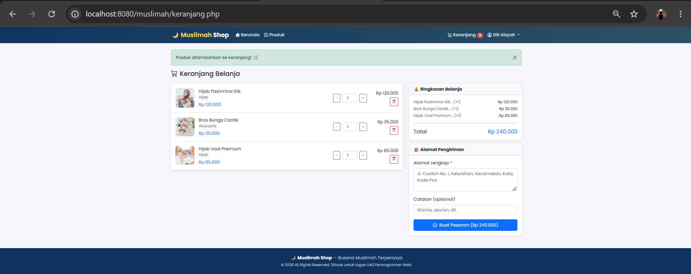

# 🌙 Muslimah Shop

Aplikasi e-commerce sederhana untuk menjual produk busana muslimah, dibuat menggunakan PHP Native dan MySQL
---

## 📋 Deskripsi

**Muslimah Shop** adalah website toko online yang menjual produk busana muslimah seperti hijab, gamis, aksesoris, dan tas. Website ini memiliki dua jenis pengguna, yaitu **customer** (pengguna biasa) dan **admin**, masing-masing dengan fitur dan halaman yang berbeda.

---

## ✨ Fitur

### 👤 Pengguna (Customer)
- Register & Login dengan autentikasi aman (password di-hash dengan bcrypt)
- Halaman beranda dengan hero section, statistik toko, dan produk terbaru
- Katalog produk dengan fitur **pencarian**, **filter kategori**, dan **pengurutan** (termurah, termahal, nama)
- Keranjang belanja (tambah, ubah jumlah, hapus item)
- Proses checkout dengan input alamat pengiriman
- Notifikasi flash message setiap aksi

### 🔧 Admin
- Dashboard dengan statistik total produk, pelanggan, pesanan, dan omzet
- Kelola Produk (CRUD: tambah, lihat, edit, hapus + upload gambar)
- Kelola Kategori
- Kelola Pesanan (update status: pending → diproses → dikirim → selesai)
- Kelola Data Users
- Notifikasi stok produk yang menipis (< 5 item)

---

## 🛠️ Teknologi yang Digunakan

| Komponen | Teknologi |
|---|---|
| Bahasa Back-End | PHP (Native) |
| Database | MySQL |
| Koneksi DB | MySQLi (OOP) |
| Front-End | HTML, CSS, Bootstrap 5 |
| Ikon | Bootstrap Icons |
| Font | Google Fonts (Poppins) |
| Server Lokal | XAMPP / Laragon |

---

## 📁 Struktur Folder

```
muslimah/
├── includes/
│   ├── config.php        # Konfigurasi DB, konstanta, dan helper function
│   ├── header.php        # Template navbar
│   └── footer.php        # Template footer
├── admin/
│   ├── index.php         # Dashboard admin
│   ├── produk.php        # Kelola produk (CRUD)
│   ├── kategori.php      # Kelola kategori
│   ├── pesanan.php       # Kelola pesanan
│   └── users.php         # Kelola pengguna
├── image/                # Folder gambar produk
├── index.php             # Halaman beranda
├── produk.php            # Katalog produk
├── detail_produk.php     # Detail produk
├── keranjang.php         # Keranjang belanja & checkout
├── pesanan.php           # Riwayat pesanan user
├── login.php             # Halaman login
├── register.php          # Halaman register
├── logout.php            # Proses logout
└── database.sql          # File SQL (struktur tabel + data awal)
```

---

## 🗄️ Struktur Database

Database: `ecommerce_db`

| Tabel | Keterangan |
|---|---|
| `users` | Data akun pengguna (nama, email, password hash, role) |
| `kategori` | Kategori produk (Hijab, Gamis, Aksesoris, Tas) |
| `produk` | Data produk (nama, deskripsi, harga, stok, gambar, kategori) |
| `keranjang` | Data sementara keranjang belanja per user |
| `pesanan` | Data pesanan (total harga, status, alamat kirim) |
| `detail_pesanan` | Rincian produk dalam setiap pesanan |

---

## 🚀 Cara Instalasi

### 1. Clone Repository
```bash
git clone https://github.com/attriana2-oss/muslimah-shop.git
```

### 2. Pindahkan ke Folder Server Lokal
Salin folder `muslimah-shop` ke dalam folder htdocs (XAMPP) atau www (Laragon):
```
C:/xampp/htdocs/muslimah/
```

### 3. Import Database
- Buka **phpMyAdmin** di browser: `http://localhost/phpmyadmin`
- Buat database baru dengan nama: `ecommerce_db`
- Klik tab **Import**, lalu pilih file `database.sql`
- Klik **Go** / **Kirim**

### 4. Sesuaikan Konfigurasi (jika perlu)
Buka file `includes/config.php` dan sesuaikan jika ada yang berbeda:
```php
define('DB_HOST', 'localhost');
define('DB_USER', 'root');
define('DB_PASS', '');          // isi password MySQL jika ada
define('DB_NAME', 'ecommerce_db');
define('SITE_URL', 'http://localhost:8080/muslimah');
```

### 5. Jalankan Website
Buka browser dan akses:
```
http://localhost:8080/muslimah/
```
atau sesuaikan port dengan pengaturan server lokal Anda.

---

## 👤 Akun Demo

| Role | Email | Password |
|---|---|---|
| Admin | admin@shop.com | password |
| User | user@shop.com | password |

---

## 📸 Screenshot

### Halaman Login


### Halaman Beranda


### Katalog Produk


### Keranjang Belanja



---

## 📝 Lisensi

Project ini dibuat untuk keperluan tugas akademik (UAS Pemrograman Web). Bebas digunakan sebagai referensi belajar.

---

## 👩‍💻 Author

**[Attriana Bertin]**  
[Universitas Tarakanita]  
[Prodi Sistem Informasi]  
[2026]
